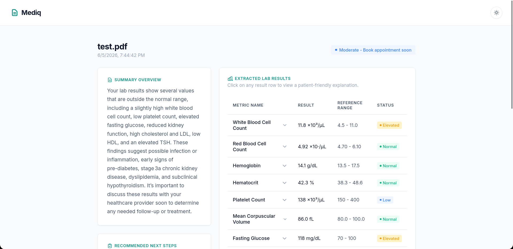

# Mediq

[](https://mediq-srqr.onrender.com/)

**Mediq** is a web-based tool for analyzing medical documents (certificates, lab results, discharge summaries) in PDF format. The application helps patients decipher complex medical terminology and understand their health metrics in plain and accessible language.



---

## ⚠️ IMPORTANT DISCLAIMER

**MUST READ BEFORE USING THE PROJECT:**

This project is powered by generative Artificial Intelligence (LLM) technologies.

1. **Not a doctor and does not provide medical advice:** The application does not diagnose, prescribe medications, recommend treatments, or replace professional medical care under any circumstances.
2. **Risk of AI Errors (Hallucinations):** Neural networks can make mistakes, misinterpret PDF data, confuse terms, or output convincing but entirely incorrect information. **Never blindly trust the analysis results.**
3. **Legal Restrictions:** In some jurisdictions, using AI for medical diagnosis or consulting is strictly regulated or **completely prohibited**. The user bears full responsibility for using this tool.
4. **Consult a specialist:** Any decisions regarding your health must be made **only** after consulting a qualified healthcare professional.

**If you feel unwell or are in an emergency situation, contact your local emergency services immediately.**

---

## 🚀 Features

- **Server-Side PDF Processing:** Text is extracted on the server side using `PyMuPDF` — making it more reliable than browser-based PDF.js, especially for complex documents.
- **Dual API Providers:** Support for both OpenRouter and Groq API keys with client-side failover retry.
- **API Key Security:** API keys are stored only in the browser's `sessionStorage` (cleared when the tab is closed) and sent directly to the server only at the moment of the request.
- **Clear Interface:** The tool extracts specific medical metrics, compares them with standard reference ranges, and provides brief, easy-to-understand explanations.
- **Urgency Indication:** The system color-codes the status of results (normal, elevated, low, critical) and the recommended action timeline (routine, followup, soon, urgent).
- **Save Results:** Export the summary and metrics to a clean `.txt` file.

---

## 🛠 Installation and Setup

Requires **Python 3.10+**.

### 1. Clone or download the repository

```bash
git clone https://github.com/hiri-dev/Mediq.git
cd Mediq
```

### 2. Create a virtual environment and install dependencies

```bash
python3 -m venv .venv
.venv/bin/pip install -r requirements.txt
```

### 3. Run the server

```bash
.venv/bin/python app.py
```

Open your browser and navigate to **http://localhost:5000**

> To change the port, set the env variable: `PORT=8080 .venv/bin/python app.py`

### 4. Usage

1. Select your preferred **API Provider** (OpenRouter or Groq) and enter your API Key on the landing screen (requires an account at [openrouter.ai](https://openrouter.ai/) or [console.groq.com](https://console.groq.com/)).
2. Alternatively, you can pre-configure keys on the server side using the `OPENROUTER_API_KEY` and `GROQ_API_KEY` environment variables.
3. Upload a text-based medical PDF document (up to 10 MB).
4. Wait for the AI analysis to complete. If the chosen provider fails, Mediq automatically retries with the fallback provider.
5. Review the results: metrics table, summary overview, and recommended actions.

---

## 💻 Tech Stack

| Component | Technology |
|---|---|
| Web Framework | **Flask 3** |
| PDF Parsing | **PyMuPDF** (`fitz`) |
| HTTP Client | **httpx** |
| LLM Integration | **OpenRouter / Groq API** (`openai/gpt-oss-20b`) |
| Frontend | Vanilla HTML / CSS / JS (embedded in `app.py`) |

---

## 📁 Project Structure

```
Mediq/
├── app.py            # Flask backend & HTML template
├── requirements.txt  # Python package dependencies
├── .gitignore        # Git ignore configurations
├── README.md         # Documentation
├── screenshot.png    # App screenshot for README
└── test.pdf          # Sample patient medical report for testing
```
